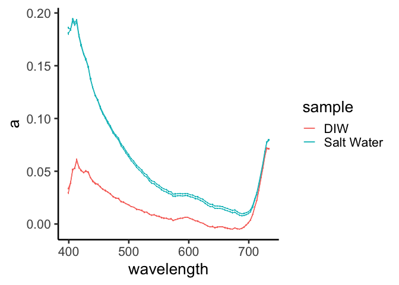
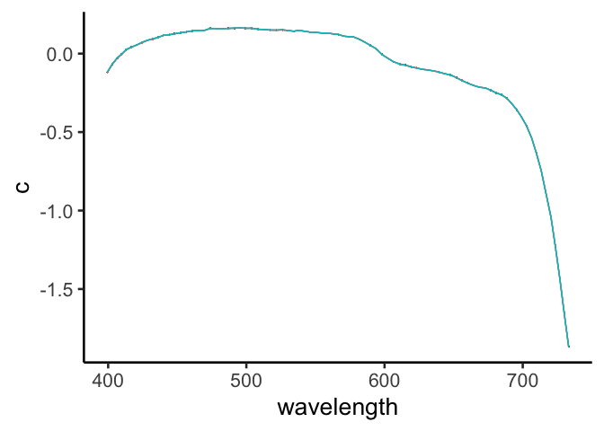

ACS processing from Lab 2
================
Nicholas Baetge
7/20/2021

# Load Libraries

``` r
library(tidyverse)
```

    ## Warning: package 'tidyverse' was built under R version 4.0.2

    ## ── Attaching packages ─────────────────────────────────────────── tidyverse 1.3.0 ──

    ## ✓ ggplot2 3.3.0     ✓ purrr   0.3.4
    ## ✓ tibble  3.0.1     ✓ dplyr   1.0.4
    ## ✓ tidyr   1.0.3     ✓ stringr 1.4.0
    ## ✓ readr   1.3.1     ✓ forcats 0.5.0

    ## Warning: package 'dplyr' was built under R version 4.0.2

    ## ── Conflicts ────────────────────────────────────────────── tidyverse_conflicts() ──
    ## x dplyr::filter() masks stats::filter()
    ## x dplyr::lag()    masks stats::lag()

``` r
library(readxl)
```

    ## Warning: package 'readxl' was built under R version 4.0.2

``` r
library(ggpubr)
library(fs)
```

    ## Warning: package 'fs' was built under R version 4.0.2

``` r
library(lubridate)
```

    ## 
    ## Attaching package: 'lubridate'

    ## The following objects are masked from 'package:base':
    ## 
    ##     date, intersect, setdiff, union

# Import Data

``` r
#save filenames that are in the folder of interest
csv_files <- fs::dir_ls("~/GITHUB/oceanoptics2021/data/ACS43_720/", regexp = "\\.csv$")
```

``` r
#the first two rows of the acs data output contain header and unit data. we'll store those separately...units first and we'll circle back to headers
units <- colnames(read_csv(csv_files[1], skip = 1))
```

    ## Warning: Duplicated column names deduplicated: 'deg_C' => 'deg_C_1' [6]

    ## Parsed with column specification:
    ## cols(
    ##   `yyyy/mm/dd HH:MM:SS.fff` = col_character(),
    ##   ms = col_double(),
    ##   `1/m   lambda=399.3 402.5 406.0 409.4 412.8 416.2 420.1 424.0 428.3 432.0 435.5 439.6 443.3 447.9 452.0 456.4 460.1 464.3 468.5 473.3 477.8 482.0 486.6 490.4 494.8 498.9 503.3 507.4 512.1 516.5 521.1 525.4 529.6 533.5 537.5 541.8 545.6 549.9 554.1 558.2 562.3 566.1 569.8 573.4 576.8 579.8 583.7 587.6 591.8 595.7 599.9 604.3 608.5 612.8 617.2 621.4 625.4 629.7 633.7 637.7 641.6 645.8 650.1 654.2 658.5 662.9 666.8 671.3 675.0 679.3 682.9 686.8 690.5 694.1 697.8 701.3 704.9 708.4 711.8 715.3 718.7 722.1 725.7 728.9 732.1` = col_character(),
    ##   `1/m   lambda=399.4 403.0 406.6 409.8 413.2 416.9 420.6 424.6 428.5 432.5 436.1 439.8 444.2 448.1 452.5 456.7 461.0 464.8 469.2 473.8 478.2 482.7 487.1 491.3 495.3 499.5 503.8 508.3 513.0 517.1 521.8 526.0 530.1 534.2 538.0 542.3 546.3 550.4 554.6 558.6 562.8 566.6 570.5 573.9 577.3 581.9 585.6 589.6 593.9 598.1 602.3 606.5 611.0 615.0 619.2 623.2 627.4 631.4 635.5 639.5 643.6 647.6 651.9 656.0 660.3 664.4 668.7 672.9 676.7 680.7 684.6 688.4 692.0 695.7 699.1 702.8 706.5 709.9 713.4 716.6 720.5 723.5 726.8 730.0 733.2` = col_character(),
    ##   deg_C = col_double(),
    ##   deg_C_1 = col_double(),
    ##   bool = col_logical()
    ## )

``` r
#extract the wavelengths from the "a" column and store as a vector (these are also the same for c)
wavelengths <- units[4] %>% strsplit(., split = " ") %>% .[[1]] %>%  str_remove(., "1/m lambda=") 
   
#store all data from all files one data frame (this is what the map_dfr function does). We'll add the filenames to the dataframe as well, in a column called "source. 
data <- csv_files %>% 
  map_dfr(read.csv, skip = 2, header = F, .id = "source") %>% 
  #shorten the filenames
  mutate(source = gsub("/Users/nicholasbaetge/GITHUB/oceanoptics2021/data/", "", source),
         source = gsub(".csv", "", source)) %>% 
  #add some distinguisihing metadata about the filenames 
  mutate(sample = ifelse(source %in% c( "ACS43_720/DIW_ACS43_20210720_202222", "ACS43_720/DIW_ACS43_20210720_202453"), "test", NA),
         sample = ifelse(source %in% c( "ACS43_720/DIW_ACS43_20210720_203656", "ACS43_720/DIW_ACS43_20210720_204055"), "DIW", sample),
         sample = ifelse(source %in% c( "ACS43_720/DIW_ACS43_20210720_210053", "ACS43_720/DIW_ACS43_20210720_210454"), "Salt Water", sample)) %>%
  select(source, sample, everything())

#add the headers to the dataframe
headers <- c("source", "sample", colnames(read_csv(csv_files[1])))
```

    ## Parsed with column specification:
    ## cols(
    ##   time = col_character(),
    ##   acs_timestamp = col_character(),
    ##   c = col_character(),
    ##   a = col_character(),
    ##   T_int = col_character(),
    ##   T_ext = col_character(),
    ##   flag_outside_calibration_range = col_character()
    ## )

``` r
colnames(data) <-  headers
```

``` r
glimpse(data)
```

    ## Rows: 1,598
    ## Columns: 9
    ## $ source                         <chr> "ACS43_720/DIW_ACS43_20210720_202222",…
    ## $ sample                         <chr> "test", "test", "test", "test", "test"…
    ## $ time                           <chr> "2021/07/20 20:22:22.808", "2021/07/20…
    ## $ acs_timestamp                  <int> 739348, 739599, 739849, 740098, 740348…
    ## $ c                              <chr> " [-0.33389476 -0.30680891 -0.28555071…
    ## $ a                              <chr> " [ 3.70047664e-03  7.26499112e-03  1.…
    ## $ T_int                          <dbl> 24.14, 24.15, 24.15, 24.13, 24.14, 24.…
    ## $ T_ext                          <dbl> 23.94, 23.93, 23.93, 23.94, 23.93, 23.…
    ## $ flag_outside_calibration_range <chr> " False", " False", " False", " False"…

# a

``` r
#extract the a-tube data and separate out the data
a <- data %>% 
  select(a) %>% 
  #there are sometimes one, two, or three spaces between the data. str_squish helps us deal with that
  mutate(a = str_squish(a)) %>% 
  #remove the brackets
  mutate(a = str_replace_all(a, "\\[|\\]", "")) %>%
  mutate(a = str_squish(a)) %>% 
  separate(a, sep = " ", into = wavelengths) %>% 
  mutate_all(as.numeric)
```

``` r
#combine a data with metadata and change data classes
a_data <- bind_cols(data, a) %>% 
  select(-c, -a) %>% 
  mutate(time = ymd_hms(time)) %>% 
  group_by(source) %>% 
   mutate(interv = interval(first(time), time),
         s = as.numeric(interv),
         min = s/60) %>% 
  select(source:time, interv:min, everything()) %>% 
  ungroup() 
```

## medians and se

``` r
#calculate medians for each wavelength
a_med <- a_data %>% 
  select(source:sample, c(11:95)) %>% 
  group_by(source) %>% 
  mutate_at(c(3:87), list(med = median)) %>% 
  ungroup() %>% 
  select(source:sample, contains("med")) %>% 
  rename_at(.vars = vars(ends_with("_med")),
            .funs = funs(sub("_med", "", .)))
```

    ## Warning: `funs()` is deprecated as of dplyr 0.8.0.
    ## Please use a list of either functions or lambdas: 
    ## 
    ##   # Simple named list: 
    ##   list(mean = mean, median = median)
    ## 
    ##   # Auto named with `tibble::lst()`: 
    ##   tibble::lst(mean, median)
    ## 
    ##   # Using lambdas
    ##   list(~ mean(., trim = .2), ~ median(., na.rm = TRUE))
    ## This warning is displayed once every 8 hours.
    ## Call `lifecycle::last_warnings()` to see where this warning was generated.

``` r
#calculate se
a_se <- a_data %>% 
  select(source:sample, c(11:95)) %>% 
  group_by(source) %>% 
  mutate_at(c(3:87), list(se = function(x) sd(x) / sqrt(length(x)))) %>% 
  ungroup() %>% 
  select(source:sample, contains("se")) %>% 
  rename_at(.vars = vars(ends_with("_se")),
            .funs = funs(sub("_se", "", .)))

#combine median and se data and melt for plotting
a_pivot <- a_med %>% 
  pivot_longer(c(3:87), names_to = "wl", values_to = "a" ) %>%
  mutate_at(vars(a), as.numeric) %>% 
  bind_cols(., 
            a_se %>% 
  pivot_longer(c(3:87), names_to = "wl", values_to = "se" ) %>%
  mutate_at(vars(se), as.numeric) %>% select(-source, -sample, -wl)) %>% 
  mutate_at(vars(wl), as.numeric)
```

## plot

``` r
a_pivot %>%
  filter(sample %in% c("DIW", "Salt Water")) %>% 
  ggplot(aes(x = wl, y = a, group = interaction(sample, source), color = sample)) +
  geom_errorbar(aes(ymin = a - se, ymax = a + se), width = 0.5) +
  geom_line() + 
  labs(x = "wavelength") +
  theme_classic2(20)
```

<!-- -->

# c

follows process as for a

``` r
c <- data %>% 
  select(c) %>% 
  mutate(c = str_squish(c)) %>% 
  #remove the brackets
  mutate(c = str_replace_all(c, "\\[|\\]", "")) %>%
  mutate(c = str_squish(c)) %>% 
  separate(c, sep = " ", into = wavelengths) %>% 
  mutate_all(as.numeric)
```

``` r
c_data <- bind_cols(data, c) %>% 
  select(-c, -a) %>% 
  mutate(time = ymd_hms(time)) %>% 
  group_by(source) %>% 
   mutate(interv = interval(first(time), time),
         s = as.numeric(interv),
         min = s/60) %>% 
  select(source:time, interv:min, everything()) %>% 
  ungroup() 
```

## medians and se

``` r
c_med <- c_data %>% 
  select(source:sample, c(11:95)) %>% 
  group_by(source) %>% 
  mutate_at(c(3:87), list(med = median)) %>% 
  ungroup() %>% 
  select(source:sample, contains("med")) %>% 
  rename_at(.vars = vars(ends_with("_med")),
            .funs = funs(sub("_med", "", .)))
```

``` r
c_se <- c_data %>% 
  select(source:sample, c(11:95)) %>% 
  group_by(source) %>% 
  mutate_at(c(3:87), list(se = function(x) sd(x) / sqrt(length(x)))) %>% 
  ungroup() %>% 
  select(source:sample, contains("se")) %>% 
  rename_at(.vars = vars(ends_with("_se")),
            .funs = funs(sub("_se", "", .)))

c_pivot <- c_med %>% 
  pivot_longer(c(3:87), names_to = "wl", values_to = "c" ) %>%
  mutate_at(vars(c), as.numeric) %>% 
  bind_cols(., 
            c_se %>% 
  pivot_longer(c(3:87), names_to = "wl", values_to = "se" ) %>%
  mutate_at(vars(se), as.numeric) %>% select(-source, -sample, -wl)) %>% 
  mutate_at(vars(wl), as.numeric)
```

## plot

``` r
c_pivot %>%
  filter(sample %in% c("DIW", "Salt Water")) %>% 
  ggplot(aes(x = wl, y = c, group = interaction(sample, source), color = sample)) +
  geom_errorbar(aes(ymin = c - se, ymax = c + se), width = 0.5) +
  geom_line() + 
  # facet_grid(~sample) +
  labs(x = "wavelength") +
  guides(color = F) +
  theme_classic2(20)
```

<!-- -->
