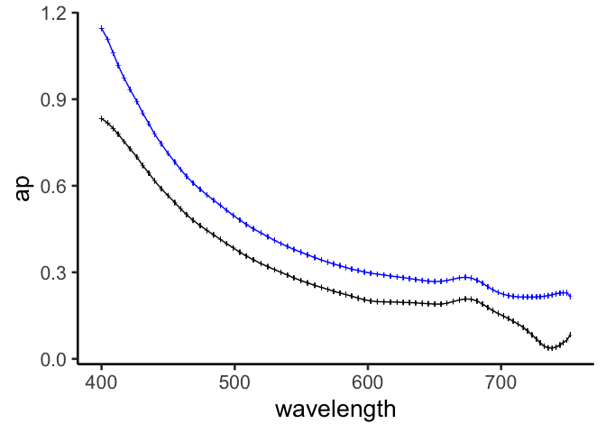
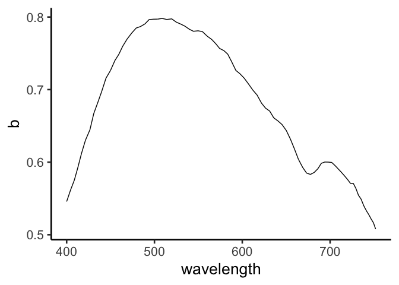

acs\_lab3
================
Nicholas Baetge
7/21/2021

# Load Libraries

``` r
library(tidyverse)
```

    ## Warning: package 'tidyverse' was built under R version 4.0.2

    ## ── Attaching packages ─────────────────────────────────────────── tidyverse 1.3.0 ──

    ## ✓ ggplot2 3.3.0     ✓ purrr   0.3.4
    ## ✓ tibble  3.0.1     ✓ dplyr   1.0.4
    ## ✓ tidyr   1.0.3     ✓ stringr 1.4.0
    ## ✓ readr   1.3.1     ✓ forcats 0.5.0

    ## Warning: package 'dplyr' was built under R version 4.0.2

    ## ── Conflicts ────────────────────────────────────────────── tidyverse_conflicts() ──
    ## x dplyr::filter() masks stats::filter()
    ## x dplyr::lag()    masks stats::lag()

``` r
library(readxl)
```

    ## Warning: package 'readxl' was built under R version 4.0.2

``` r
library(ggpubr)
library(fs)
```

    ## Warning: package 'fs' was built under R version 4.0.2

``` r
library(lubridate)
```

    ## 
    ## Attaching package: 'lubridate'

    ## The following objects are masked from 'package:base':
    ## 
    ##     date, intersect, setdiff, union

# Import Data

``` r
#save filenames that are in the folder of interest
csv_files <- fs::dir_ls("~/GITHUB/oceanoptics2021/data/acs94_lab3_721/", regexp = "\\.csv$")
```

``` r
#the first two rows of the acs data output contain header and unit data. we'll store those separately...units first and we'll circle back to headers
units <- colnames(read_csv(csv_files[1], skip = 1))
```

    ## Warning: Duplicated column names deduplicated: 'deg_C' => 'deg_C_1' [6]

    ## Parsed with column specification:
    ## cols(
    ##   `yyyy/mm/dd HH:MM:SS.fff` = col_character(),
    ##   ms = col_double(),
    ##   `1/m   lambda=400.5 404.8 408.9 412.6 416.9 421.7 426.5 431.1 435.7 440.0 444.9 450.0 454.8 459.4 464.0 468.5 473.8 479.0 484.1 489.0 493.5 498.6 503.5 508.5 513.7 519.4 524.2 529.2 533.9 538.9 544.0 549.0 554.1 559.3 564.5 569.3 573.6 578.1 582.5 586.9 591.2 595.5 600.3 605.0 609.8 614.7 619.7 624.5 629.2 633.7 638.5 643.1 647.9 652.6 657.0 661.6 666.4 670.8 675.4 679.8 683.8 687.9 692.0 695.5 699.6 703.4 707.1 710.7 714.4 717.7 721.1 724.3 727.5 730.5 733.4 736.4 739.2 742.1 744.8 747.6 749.8` = col_character(),
    ##   `1/m   lambda=400.0 404.6 408.7 412.5 416.9 421.4 426.5 430.9 435.5 439.8 444.8 449.9 455.0 459.4 463.8 468.7 474.0 479.2 484.1 489.2 493.9 498.9 503.8 508.7 514.0 519.7 524.8 529.9 534.6 539.6 544.4 549.7 554.6 560.1 565.2 569.8 574.2 579.0 583.4 587.8 592.7 597.4 602.1 607.0 612.0 616.9 621.9 626.5 631.2 635.8 640.8 645.3 650.2 654.9 659.3 663.9 668.8 673.2 677.6 681.9 686.1 690.0 693.9 697.8 701.8 705.5 709.1 712.8 716.6 719.8 723.2 726.5 729.4 732.3 735.3 738.3 741.3 744.2 746.7 749.4 751.9` = col_character(),
    ##   deg_C = col_double(),
    ##   deg_C_1 = col_double(),
    ##   bool = col_logical()
    ## )

``` r
#extract the wavelengths from the "a" column and store as a vector (these are also the same for c)
wavelengths <- units[4] %>% strsplit(., split = " ") %>% .[[1]] %>%  str_remove(., "1/m lambda=") 
   
#store all data from all files one data frame (this is what the map_dfr function does). We'll add the filenames to the dataframe as well, in a column called "source. 
data <- csv_files %>% 
  map_dfr(read.csv, skip = 2, header = F, .id = "source") %>% 
  #shorten the filenames
  mutate(source = gsub("/Users/nicholasbaetge/GITHUB/oceanoptics2021/data/", "", source),
         source = gsub(".csv", "", source)) %>% 
  #add some distinguisihing metadata about the filenames 
  mutate(sample = ifelse(source == "acs94_lab3_721/ACS94_20210721_175023", "a cal 1", NA),
        sample = ifelse(source == "acs94_lab3_721/DIW_ACS94_20210721_175625", "a cal 2", sample),
        sample = ifelse(source == "acs94_lab3_721/DIW_ACS94_20210721_180208", "c cal 1", sample),
        sample = ifelse(source == "acs94_lab3_721/DIW_ACS94_20210721_180545", "c cal 2", sample),
        sample = ifelse(source == "acs94_lab3_721/DIW_ACS94_20210721_180956", "c cal 3", sample),
        
           sample = ifelse(source ==  "acs94_lab3_721/DIW_ACS94_20210721_181513", "a filtrate", sample),
        sample = ifelse(source ==  "acs94_lab3_721/DIW_ACS94_20210721_181649", "c filtrate", sample),
        sample = ifelse(source ==  "acs94_lab3_721/DIW_ACS94_20210721_182207", "c whole", sample),
        sample = ifelse(source ==  "acs94_lab3_721/DIW_ACS94_20210721_182414", "a whole", sample),
        
        sample = ifelse(source ==  "acs94_lab3_721/DIW_ACS94_20210721_183400", "a cal 4", sample),
         sample = ifelse(source == 
        "acs94_lab3_721/DIW_ACS94_20210721_183439", "unknown", sample),
      
         sample = ifelse(source ==  "acs94_lab3_721/DIW_ACS94_20210721_184004", "a cal 5", sample),
        sample = ifelse(source ==  "acs94_lab3_721/DIW_ACS94_20210721_185427", "c cal 6", sample),
     
        sample = ifelse(source ==  "acs94_lab3_721/DIW_ACS94_20210721_184637", "discrete a filtrate", sample),
        sample = ifelse(source ==  "acs94_lab3_721/DIW_ACS94_20210721_185739", "discrete c filtrate", sample),
        
        
        
                    ) %>%
  select(source, sample, everything())

#add the headers to the dataframe
headers <- c("source", "sample", colnames(read_csv(csv_files[1])))
```

    ## Parsed with column specification:
    ## cols(
    ##   time = col_character(),
    ##   acs_timestamp = col_character(),
    ##   c = col_character(),
    ##   a = col_character(),
    ##   T_int = col_character(),
    ##   T_ext = col_character(),
    ##   flag_outside_calibration_range = col_character()
    ## )

``` r
colnames(data) <-  headers
```

# a

``` r
#extract the a-tube data and separate out the data
a <- data %>% 
  select(a) %>% 
  #there are sometimes one, two, or three spaces between the data. str_squish helps us deal with that
  mutate(a = str_squish(a)) %>% 
  #remove the brackets
  mutate(a = str_replace_all(a, "\\[|\\]", "")) %>%
  mutate(a = str_squish(a)) %>% 
  separate(a, sep = " ", into = wavelengths) %>% 
  mutate_all(as.numeric)
```

``` r
#combine a data with metadata and change data classes
a_data <- bind_cols(data, a) %>% 
  select(-c, -a) %>% 
  mutate(time = ymd_hms(time)) %>% 
  group_by(source) %>% 
   mutate(interv = interval(first(time), time),
         s = as.numeric(interv),
         min = s/60) %>% 
  select(source:time, interv:min, everything()) %>% 
  ungroup() 
```

## medians and se

``` r
#calculate medians for each wavelength
a_med <- a_data %>% 
  select(source:sample, c(11:91)) %>% 
  group_by(source) %>% 
  mutate_at(c(3:83), list(med = median)) %>% 
  ungroup() %>% 
  select(source:sample, contains("med")) %>% 
  distinct() %>% 
  rename_at(.vars = vars(ends_with("_med")),
            .funs = funs(sub("_med", "", .)))
```

    ## Warning: `funs()` is deprecated as of dplyr 0.8.0.
    ## Please use a list of either functions or lambdas: 
    ## 
    ##   # Simple named list: 
    ##   list(mean = mean, median = median)
    ## 
    ##   # Auto named with `tibble::lst()`: 
    ##   tibble::lst(mean, median)
    ## 
    ##   # Using lambdas
    ##   list(~ mean(., trim = .2), ~ median(., na.rm = TRUE))
    ## This warning is displayed once every 8 hours.
    ## Call `lifecycle::last_warnings()` to see where this warning was generated.

``` r
#calculate se
a_se <- a_data %>% 
  select(source:sample, c(11:91)) %>% 
  group_by(source) %>% 
  mutate_at(c(3:83), list(se = function(x) sd(x) / sqrt(length(x)))) %>% 
  ungroup() %>% 
  select(source:sample, contains("se")) %>% 
  distinct() %>% 
  rename_at(.vars = vars(ends_with("_se")),
            .funs = funs(sub("_se", "", .)))

#combine median and se data and melt for plotting
a_pivot <- a_med %>% 
  pivot_longer(c(3:83), names_to = "wl", values_to = "a" ) %>%
  mutate_at(vars(a), as.numeric) %>% 
  bind_cols(., 
            a_se %>% 
  pivot_longer(c(3:83), names_to = "wl", values_to = "se" ) %>%
  mutate_at(vars(se), as.numeric) %>% select(-source, -sample, -wl)) %>% 
  mutate_at(vars(wl), as.numeric)
```

## corrections to derive ap

``` r
corrected_a <- a_pivot %>% 
  filter(sample %in% c("discrete a filtrate", "a cal 5", "a whole")) %>% 
  mutate(total_a = ifelse(sample == "a whole", a, NA),
         cdom_a = ifelse(sample == "discrete a filtrate", a, NA),
         water_a = ifelse(sample == "a cal 5", a, NA),
         se_total_a = ifelse(sample == "a whole", se, NA)) %>% 
  group_by(wl) %>% 
  fill(c(total_a, cdom_a, water_a, se_total_a), .direction = "updown") %>% 
  ungroup() %>% 
  select(wl, total_a, cdom_a, water_a, se_total_a) %>% 
  mutate(ap = total_a - cdom_a - water_a)
```

## plot

``` r
corrected_a %>%
  rename(se = se_total_a) %>% 
  select(wl, total_a, ap, se) %>% 
  ggplot(aes(x = wl, y = ap)) +
  geom_errorbar(aes(ymin = ap - se, ymax = ap + se), size = 2, width = 0.5) +
  geom_line() +
  geom_line(aes(y = total_a), color = "blue") +
  geom_errorbar(aes(ymin = total_a - se, ymax = total_a + se), size = 2, width = 0.5, color = "blue") +
  labs(x = "wavelength") +
  theme_classic2(20)
```

<!-- -->

# c

follows process as for a

``` r
c <- data %>% 
  select(c) %>% 
  mutate(c = str_squish(c)) %>% 
  #remove the brackets
  mutate(c = str_replace_all(c, "\\[|\\]", "")) %>%
  mutate(c = str_squish(c)) %>% 
  separate(c, sep = " ", into = wavelengths) %>% 
  mutate_all(as.numeric)
```

``` r
c_data <- bind_cols(data, c) %>% 
  select(-c, -a) %>% 
  mutate(time = ymd_hms(time)) %>% 
  group_by(source) %>% 
   mutate(interv = interval(first(time), time),
         s = as.numeric(interv),
         min = s/60) %>% 
  select(source:time, interv:min, everything()) %>% 
  ungroup() 
```

## medians and se

``` r
c_med <- c_data %>% 
  select(source:sample, c(11:91)) %>% 
  group_by(source) %>% 
  mutate_at(c(3:83), list(med = median)) %>% 
  ungroup() %>% 
  select(source:sample, contains("med")) %>% 
  distinct() %>% 
  rename_at(.vars = vars(ends_with("_med")),
            .funs = funs(sub("_med", "", .)))
```

``` r
c_se <- c_data %>% 
  select(source:sample, c(11:91)) %>% 
  group_by(source) %>% 
  mutate_at(c(3:83), list(se = function(x) sd(x) / sqrt(length(x)))) %>% 
  ungroup() %>% 
  select(source:sample, contains("se")) %>% 
  distinct() %>% 
  rename_at(.vars = vars(ends_with("_se")),
            .funs = funs(sub("_se", "", .)))

c_pivot <- c_med %>% 
  pivot_longer(c(3:83), names_to = "wl", values_to = "c" ) %>%
  mutate_at(vars(c), as.numeric) %>% 
  bind_cols(., 
            c_se %>% 
  pivot_longer(c(3:83), names_to = "wl", values_to = "se" ) %>%
  mutate_at(vars(se), as.numeric) %>% select(-source, -sample, -wl)) %>% 
  mutate_at(vars(wl), as.numeric)
```

## corrections to derive cp

``` r
corrected_c <- c_pivot %>% 
  filter(sample %in% c("discrete c filtrate", "c cal 6", "c whole")) %>% 
  mutate(total_c = ifelse(sample == "c whole", c, NA),
         cdom_c = ifelse(sample == "discrete c filtrate", c, NA),
         water_c = ifelse(sample == "c cal 6", c, NA),
         se_total_c = ifelse(sample == "c whole", se, NA)) %>% 
  group_by(wl) %>% 
  fill(c(total_c, cdom_c, water_c, se_total_c), .direction = "updown") %>% 
  ungroup() %>% 
  select(wl, total_c, cdom_c, water_c, se_total_c) %>% 
  mutate(cp = total_c - cdom_c - water_c)
```

# b uncorrected

``` r
b <- left_join(corrected_a %>% select(wl, ap), corrected_c %>% select(wl, cp)) %>% 
  mutate(b = cp - ap)
```

    ## Joining, by = "wl"

## plot

``` r
b %>%
  ggplot(aes(x = wl, y = b)) +
  geom_line() +
  labs(x = "wavelength") +
  theme_classic2(20)
```

<!-- -->
