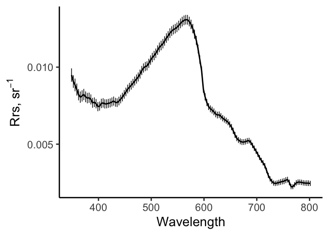
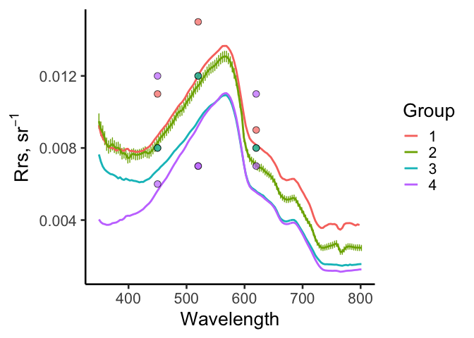

lab7 above water radiometry
================
Nicholas Baetge
7/26/2021

# Load Libraries

``` r
library(tidyverse)
```

    ## Warning: package 'tidyverse' was built under R version 4.0.2

    ## ── Attaching packages ───────────────────────────────────────────────────────────────────── tidyverse 1.3.0 ──

    ## ✓ ggplot2 3.3.0     ✓ purrr   0.3.4
    ## ✓ tibble  3.0.1     ✓ dplyr   1.0.4
    ## ✓ tidyr   1.0.3     ✓ stringr 1.4.0
    ## ✓ readr   1.3.1     ✓ forcats 0.5.0

    ## Warning: package 'dplyr' was built under R version 4.0.2

    ## ── Conflicts ──────────────────────────────────────────────────────────────────────── tidyverse_conflicts() ──
    ## x dplyr::filter() masks stats::filter()
    ## x dplyr::lag()    masks stats::lag()

``` r
library(readxl)
```

    ## Warning: package 'readxl' was built under R version 4.0.2

``` r
library(ggpubr)
library(fs)
```

    ## Warning: package 'fs' was built under R version 4.0.2

``` r
library(lubridate)
```

    ## 
    ## Attaching package: 'lubridate'

    ## The following objects are masked from 'package:base':
    ## 
    ##     date, intersect, setdiff, union

``` r
# library(zoo)
library(patchwork)
```

    ## Warning: package 'patchwork' was built under R version 4.0.2

``` r
library(viridis)
```

    ## Warning: package 'viridis' was built under R version 4.0.2

    ## Loading required package: viridisLite

# Import Data

# Lu

``` r
#save filenames that are in the folder of interest
lu_dark <- fs::dir_ls("~/GITHUB/oceanoptics2021/data/lab7/above_water_Es_Lu/Lu_processed/g22/dark/", regexp = "\\.csv$")

lu_light <- fs::dir_ls("~/GITHUB/oceanoptics2021/data/lab7/above_water_Es_Lu/Lu_processed/g22/light/", regexp = "\\.csv$")
```

``` r
#store all data from all files one data frame (this is what the map_dfr function does). We'll add the filenames to the dataframe as well, in a column called "source. 
se = function(x) { sd(x) / sqrt(length(x)) }


dark_data <- lu_dark %>% 
  map_dfr(read.csv, header = T, .id = "source") %>% 
  mutate(source = gsub("/Users/nicholasbaetge/GITHUB/oceanoptics2021/data/lab7/above_water_Es_Lu/Lu_processed/g22/dark/", "", source),
         source = gsub(".csv", "", source)) %>% 
  mutate(source = ifelse(source == "g22_LSky_07272021-PLD180MS", "LSky", source),
         source = ifelse(source == "g22_LT_07272021-PLD180MS", "LT", source),
         source = ifelse(source == "g22_Lsky_07272021_a-PLD180MS", "LSky_2", source),
         source = ifelse(source == "g22_Lwater_07272021_a-PLD180MS", "LT_2", source),
         source = ifelse(source == "g22_calibrate_07272021-PLD180MS", "cal", source) ) %>% 
  select(-c(2:4, DARK_SAMP.LU.:TIMETAG2)) %>% 
  group_by(source) %>% 
  summarize_all(list(med = median)) %>% 
  mutate(type = "dark") %>% 
  select(source, type, everything()) 

light_data <- lu_light %>% 
  map_dfr(read.csv, header = T, .id = "source") %>% 
  mutate(source = gsub("/Users/nicholasbaetge/GITHUB/oceanoptics2021/data/lab7/above_water_Es_Lu/Lu_processed/g22/light/", "", source),
         source = gsub(".csv", "", source)) %>% 
  #add some distinguisihing metadata about the filenames 
  mutate(source = ifelse(source == "g22_LSky_07272021-HPL180MS", "LSky", source),
         source = ifelse(source == "g22_LT_07272021-HPL180MS", "LT", source),
         source = ifelse(source == "g22_Lsky_07272021_a-HPL180MS", "LSky_2", source),
         source = ifelse(source == "g22_Lwater_07272021_a-HPL180MS", "LT_2", source),
         source = ifelse(source == "g22_calibrate_07272021-HPL180MS", "cal", source) ) %>% 
  select(-c(2:4, DARK_SAMP.LU.:TIMETAG2)) %>% 
  group_by(source) %>% 
  summarize_all(list(med = median)) %>% 
  mutate(type = "light") %>% 
  select(source, type, everything()) 

combined <- bind_rows(light_data, dark_data) %>% 
  group_by(source) %>% 
  pivot_longer(cols = -c(source, type), names_to = "wl", values_to = "values") %>% 
  ungroup() %>% 
  arrange(source, wl) %>% 
  group_by(source, wl) %>% 
  mutate(diff = values[type == "light"] - values) %>% 
  ungroup() %>% 
  filter(type == "dark") %>% 
  select(c(source, wl, diff)) %>% 
  mutate(wl = gsub("LU.", "", wl),
         wl = gsub("._med", "", wl),
         wl = as.numeric(wl)
         ) %>% 
  mutate(which = "Lu")
```

# Es

``` r
#save filenames that are in the folder of interest
es_dark <- fs::dir_ls("~/GITHUB/oceanoptics2021/data/lab7/above_water_Es_Lu/Es_processed/g22/dark/", regexp = "\\.csv$")

es_light <- fs::dir_ls("~/GITHUB/oceanoptics2021/data/lab7/above_water_Es_Lu/Es_processed/g22/light/", regexp = "\\.csv$")
```

``` r
#store all data from all files one data frame (this is what the map_dfr function does). We'll add the filenames to the dataframe as well, in a column called "source. 


es_dark_data <- es_dark %>% 
  map_dfr(read.csv, header = T, .id = "source") %>% 
  mutate(source = gsub("/Users/nicholasbaetge/GITHUB/oceanoptics2021/data/lab7/above_water_Es_Lu/Es_processed/g22/dark/", "", source),
         source = gsub(".csv", "", source)) %>% 
  mutate(source = ifelse(source == "g22_LSky_07272021-HED0187o", "LSky", source),
         source = ifelse(source == "g22_LT_07272021-HED0187o", "LT", source),
         source = ifelse(source == "g22_Lsky_07272021_a-HED0187o", "LSky_2", source),
         source = ifelse(source == "g22_Lwater_07272021_a-HED0187o", "LT_2", source),
         source = ifelse(source == "g22_calibrate_07272021-HED0187o", "cal", source) ) %>% 
  select(-c(2:4, DARK_SAMP.ES.:TIMETAG2)) %>% 
  group_by(source) %>% 
  summarize_all(list(med = median)) %>% 
  mutate(type = "dark") %>% 
  select(source, type, everything()) 

es_light_data <- es_light %>% 
  map_dfr(read.csv, header = T, .id = "source") %>% 
  mutate(source = gsub("/Users/nicholasbaetge/GITHUB/oceanoptics2021/data/lab7/above_water_Es_Lu/Es_processed/g22/light/", "", source),
         source = gsub(".csv", "", source)) %>% 
  #add some distinguisihing metadata about the filenames 
  mutate(source = ifelse(source == "g22_LSky_07272021-HSE0187o", "LSky", source),
         source = ifelse(source == "g22_LT_07272021-HSE0187o", "LT", source),
         source = ifelse(source == "g22_Lsky_07272021_a-HSE0187o", "LSky_2", source),
         source = ifelse(source == "g22_Lwater_07272021_a-HSE0187o", "LT_2", source),
         source = ifelse(source == "g22_calibrate_07272021-HSE0187o", "cal", source) ) %>% 
  select(-c(2:4, DARK_SAMP.ES.:TIMETAG2)) %>% 
  group_by(source) %>% 
  summarize_all(list(med = median)) %>% 
  mutate(type = "light") %>% 
  select(source, type, everything()) 

es_combined <- bind_rows(es_light_data, es_dark_data) %>% 
  group_by(source) %>% 
  pivot_longer(cols = -c(source, type), names_to = "wl", values_to = "values") %>% 
  ungroup() %>% 
  arrange(source, wl) %>% 
  group_by(source, wl) %>% 
  mutate(diff = values[type == "light"] - values) %>% 
  ungroup() %>% 
  filter(type == "dark") %>% 
  select(c(source, wl, diff)) %>% 
  mutate(wl = gsub("ES.", "", wl),
         wl = gsub("._med", "", wl),
         wl = as.numeric(wl)
         ) %>% 
  mutate(which = "ES")
```

# Interpolate

``` r
library(zoo)
```

    ## 
    ## Attaching package: 'zoo'

    ## The following objects are masked from 'package:base':
    ## 
    ##     as.Date, as.Date.numeric

``` r
es_wl <- unique(es_combined$wl)
surf_reflect = 0.028

interp <- combined %>%
  group_by(source) %>% 
  group_modify(~ add_row(., wl = es_wl)) %>% 
  arrange(source, wl) %>% 
  group_by(source) %>% 
  fill(which, .direction = "updown") %>% 
  mutate(lu = na.approx(diff)) %>% 
  select(source, wl, lu) %>% 
  ungroup() %>% 
  left_join(., es_combined %>% 
              select(source, wl, diff) %>% rename(es = diff)) %>% 
  ungroup() %>% 
  drop_na(es) %>% 
  distinct() %>% 
  
  filter(source %in% c("LSky", "LT", "LSky_2", "LT_2")) %>% 
  group_by(wl) %>% 
  mutate(mean_es = mean(es)) %>% 
  ungroup() %>% 
  
  select(source, wl, lu, mean_es) %>% 
  distinct() %>% 
  mutate(Lg = ifelse(source %in% c("LSky", "LSky_2"), lu * surf_reflect, NA),
         Lt = ifelse(source %in% c("LT", "LT_2"), lu, NA)) %>% 
 
  group_by(wl) %>% 
    
  fill(c(Lg, Lt), .direction = "updown")  %>% 
  ungroup() %>% 
  mutate(rrs = (Lt - Lg)/mean_es) %>% 
  # filter(source %in% c("LT", "LT_2")) %>% 
  group_by(wl) %>% 
  mutate(ave = mean(rrs),
         sd = sd(rrs))
```

    ## Joining, by = c("source", "wl")

``` r
interp %>% 
  select(wl, ave, sd) %>% distinct() %>% 
  ggplot(aes(x = wl, y = ave)) +
  geom_errorbar(aes(ymin = ave - sd, ymax = ave + sd), size = 0.5, width = 1) +
  geom_line(size = 1) +
  labs(x = "Wavelength", y = expression(paste("Rrs, sr"^-1)), color = "") +
  theme_classic2(20)
```

<!-- -->

``` r
send <- interp %>% 
  select(wl, ave, sd) %>% 
  rename(ave_rrs = ave,
         sd_rrs = sd) %>% 
  mutate(group = "Nick") %>% 
  distinct() 

write_csv(send, "~/nicholasbaetge@gmail.com - Google Drive/My Drive/OO2021_StudentShareDrive/Data/Lab 7/G2p2_above_water.csv")
```

``` r
#import class data 

seb <- read_csv("~/GITHUB/oceanoptics2021/data/lab7/above_water_Es_Lu/G_2_1_Rrs.csv") %>% 
  rename(wl = `Wavelength (nm)`,
         ave_rrs = Rrs) %>% 
  select(wl, ave_rrs) %>% 
  mutate(group = "Seb")
```

    ## Warning: Missing column names filled in: 'X1' [1]

    ## Parsed with column specification:
    ## cols(
    ##   X1 = col_double(),
    ##   `Wavelength (nm)` = col_double(),
    ##   Rrs = col_double()
    ## )

``` r
sarah <- read_csv("~/GITHUB/oceanoptics2021/data/lab7/above_water_Es_Lu/rrs.csv") %>% 
  rename(wl = wave, 
         ave_rrs = rrs) %>% 
  mutate(group = "Sarah")
```

    ## Parsed with column specification:
    ## cols(
    ##   wave = col_double(),
    ##   rrs = col_double()
    ## )

``` r
edr <- read_csv("~/GITHUB/oceanoptics2021/data/lab7/above_water_Es_Lu/lab7group4.csv") 
```

    ## Parsed with column specification:
    ## cols(
    ##   wl = col_double(),
    ##   ave_rrs = col_double(),
    ##   group = col_character()
    ## )

``` r
all <- bind_rows(send, seb, sarah, edr) %>% 
  mutate(order = ifelse(group == "Seb", 1, NA),
         order = ifelse(group == "Nick", 2, order),
         order = ifelse(group == "Sarah", 3, order),
         order = ifelse(group == "Edr", 4, order),
         )
```

``` r
phone_wl <- c(450, 520, 620,
              450, 520, 620,
              450, 520, 620,
              450, 520, 620,
              450, 520, 620)

group_vals <- c(0.006, 0.007, 0.011, 
            0.012, 0.007, 0.007, 
            0.008, 0.012, 0.008, 
            0.008, 0.012, 0.008, 
            0.011, 0.015, 0.009)

groups <- c("4", "4", "4", 
            "4", "4", "4",
            "2", "2", "2",
            "3", "3", "3",
            "1", "1", "1")

all_phone <- tibble(phone_wl, group_vals, groups) %>% 
  rename(order = groups,
         wl = phone_wl) 
```

``` r
all %>% 
  rename(ave = ave_rrs,
         sd = sd_rrs) %>% 
  ggplot(aes(x = wl, y = ave, color = as.character(order))) +
  geom_errorbar(aes(ymin = ave - sd, ymax = ave + sd), size = 0.5, width = 1) +
  geom_line(size = 1) +
  geom_point(data = all_phone, aes(x = wl, y = group_vals, fill = order), shape = 21, size = 3, color = "black", alpha = 0.7) + 
  labs(x = "Wavelength", y = expression(paste("Rrs, sr"^-1)), color = "Group") +
  theme_classic2(20) + 
  guides(fill = F)
```

<!-- -->
